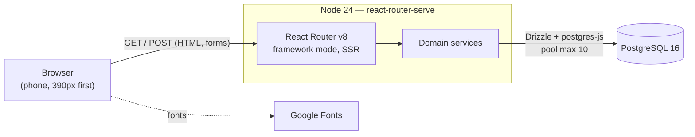
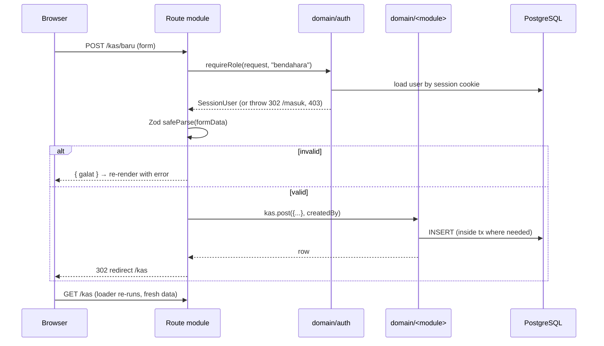
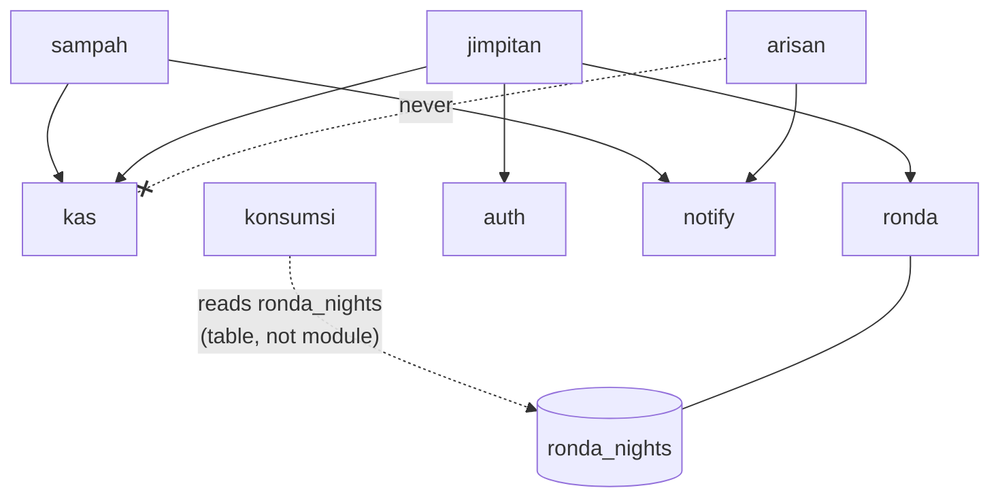
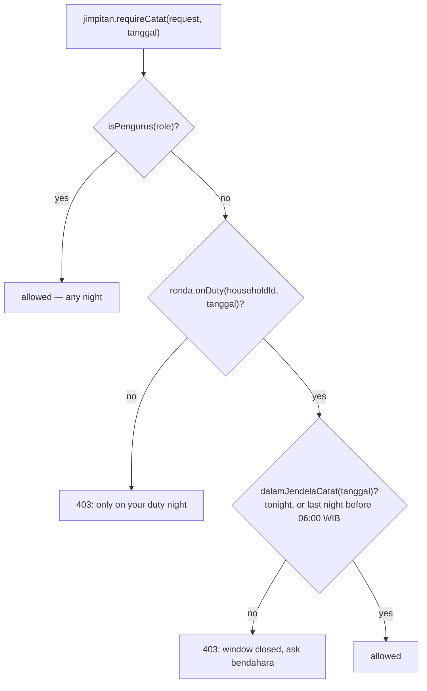

# Rumah Kita — architecture

How the system is put together, why, and where to change it. For *what the app does*
(vocabulary, roles, the seven modules) read [`ONBOARDING.md`](ONBOARDING.md) first. For
the table-level schema see [`db.dbml`](db.dbml); for the visual language see
[`../design.md`](../design.md). The original design decisions are in
[`superpowers/specs/2026-08-23-rt-app-design.md`](superpowers/specs/2026-08-23-rt-app-design.md).

> **Status: prototype.** Single RT (~52 households), no real authentication, "today"
> pinned to a fixed date. Section 9 lists every seam where production concerns attach.

## Contents

1. [Goals and constraints](#1-goals-and-constraints)
2. [System context](#2-system-context)
3. [Layers and the dependency rule](#3-layers-and-the-dependency-rule)
4. [Request lifecycle](#4-request-lifecycle)
5. [Domain layer](#5-domain-layer)
6. [Data layer](#6-data-layer)
7. [Auth and authorization](#7-auth-and-authorization)
8. [UI layer](#8-ui-layer)
9. [Seams and extension points](#9-seams-and-extension-points)
10. [Build, run, deploy](#10-build-run-deploy)
11. [Testing and verification](#11-testing-and-verification)
12. [Decisions and trade-offs](#12-decisions-and-trade-offs)
13. [Conventions](#13-conventions)

---

## 1. Goals and constraints

**Goal.** Replace a WhatsApp group, a paper ledger, and cash handed to the bendahara
with one mobile-first app for a single RT: dues, treasury, night watch, meal rota,
rotating savings, announcements.

**Constraints that shaped the design**

| Constraint | Consequence |
|---|---|
| Money must reconcile exactly | Integer rupiah, derived balance, DB-level uniqueness (§6) |
| Users are non-technical, on phones | Server-rendered, plain `<Form>` posts, 390 px first |
| Prototype scope | No auth, no tenancy, no uploads, no push — but each has a named seam (§9) |
| Small team, one codebase | One deployable, no separate API, no client state library |
| UI copy is Bahasa Indonesia | Identifiers are Indonesian too; see [conventions](#13-conventions) |

**Non-goals:** multi-RT tenancy, payment gateway, offline sync, file storage.

## 2. System context

One Node process serves HTML and handles form posts. PostgreSQL is the only stateful
dependency. Google Fonts is the only third-party runtime request (stylesheet in
`root.tsx`).



| Piece | Choice | Notes |
|---|---|---|
| Framework | React Router v8, framework mode, `ssr: true` | Loaders/actions are the only server entry points |
| Language | TypeScript 5.9, strict, `verbatimModuleSyntax` | `~/*` → `app/*` |
| DB | PostgreSQL 16 via Drizzle ORM + `postgres` driver | Schema is code; `drizzle-kit push` |
| Validation | Zod 4 | At the route boundary only |
| Styling | Tailwind 4, tokens in `app/app.css` | No component library |
| Tests | Playwright smoke suite + seed-time invariants | No unit tests (§11) |

## 3. Layers and the dependency rule

```
 routes/ ──► domain/ ──► db/
    │           │         ▲
    │           └──► lib/ │        lib/  — pure, client-safe, no DB
    └──────► ui/ ──► lib/ │        ui/   — presentational components
                          │
                       seed.ts      (calls domain/ like any route would)
```

```
app/
  routes.ts        explicit route table (20 routes)
  root.tsx         document shell, session loader, app chrome, error boundary
  routes/          one module per screen: loader + action + component
  domain/          services: every query and every write; the business rules
  db/              schema.ts · index.ts (client) · urutan.ts (sort) · seed.ts
  lib/             format · kategori · peran · waktu — pure helpers/constants
  ui/              kit.tsx (primitives) · Rail · BottomNav · BarAtas · RoleSwitcher · ikon
```

**The rules**

1. **Routes never touch Drizzle.** No route imports `~/db`. A route authorises,
   validates, calls a domain function, and renders.
2. **Domain modules own all writes and all invariants.** One rule, one place.
3. **`domain/` may import `db/` and `lib/`; `lib/` and `ui/` may not import `domain/` or
   `db/`.** Otherwise Drizzle and `postgres` leak into the client bundle (see below).
4. **Domain modules may depend on each other only in one direction** — see the graph
   in §5.

### The client-bundle boundary

React Router strips `loader`/`action` from the client build, but anything a *component*
imports ships to the browser. A component that imports a domain module pulls
`~/db` → `postgres` into the client chunk and breaks hydration. The project solves this
by splitting shared constants out of `domain/` into `lib/`:

| Client-safe (in `lib/`) | Re-exported from | Why split |
|---|---|---|
| `peran.ts` — `Role`, `TINGKAT`, `minimal()` | `domain/auth.ts` | Components render role labels / gate UI |
| `kategori.ts` — kas and pengumuman categories | `domain/kas.ts`, `domain/pengumuman.ts` | Forms render category lists |
| `waktu.ts` — `HARI_INI`, `dalamJendelaCatat()` | — | Used by both loaders and components |

**If a route component needs a constant from a domain module, move it to `lib/` and
re-export it from the domain module.** Don't import the domain module from a component.

## 4. Request lifecycle

Every screen follows the same four-step shape. Reads happen in `loader`, writes in
`action`; there is no client-side fetching.



```ts
// Canonical route shape — see app/routes/kas.baru.tsx
export async function action({ request }: Route.ActionArgs) {
  const user = await requireRole(request, "bendahara");  // 1. authorise
  const hasil = Input.safeParse(Object.fromEntries(await request.formData()));
  if (!hasil.success) return { galat: hasil.error.issues[0].message }; // 2. validate
  await kas.post({ ...hasil.data, createdBy: user.id });  // 3. one service call
  return redirect("/kas");                                // 4. post/redirect/get
}
```

**Error channels**

| Failure | Mechanism | Surface |
|---|---|---|
| Not logged in | `throw redirect('/masuk')` from `requireUser` | Login page |
| Insufficient role / not on duty | `throw new Response(msg, {status: 403})` | Root `ErrorBoundary` |
| Bad input | Zod issue returned as `{ galat }` | `<Galat>` inline |
| Rule violation (locked period, already paid, …) | `DomainError(kode, message)` thrown by service | Caught in action → `{ galat }` |
| Unexpected | Uncaught | Root `ErrorBoundary` (stack in dev only) |

`DomainError` messages are already user-facing Indonesian. `kode` is a stable machine
string (`periode_terkunci`, `sudah_lunas`, …) for branching.

## 5. Domain layer

Ten modules in `app/domain/`. Seven are feature modules; three are infrastructure.

| Module | Owns | Key functions |
|---|---|---|
| `kas` | The ledger | `post` (**only** insert path), `balance`, `monthlySummary`, `list` |
| `sampah` | Monthly rubbish fee | `generateBills`, `markPaid`, `arrears`, `roster` |
| `jimpitan` | Nightly collection | `rosterForNight`, `izinCatat`, `saveNight`, `closePeriod`, `recap*` |
| `ronda` | Night-watch schedule | `generate`, `override`, `swap`, `markAttendance`, `onDuty`, `dutyFor` |
| `konsumsi` | Meal rota | `generate`, `swap`, `markFulfilled`, `bentrok` |
| `arisan` | Rotating savings | `recordPayment`, `eligibleForDraw`, `draw`, `memberStatus` |
| `pengumuman` | Notice board | `list`, `byId`, `terbaru`, `create` |
| `auth` | Session + role gates | `getUser`, `requireUser`, `requireRole`, `login`, `logout` |
| `errors` | `DomainError` | `domainError(kode, message)` |
| `notify` | Push stubs | `notifyWarga` (no-op; see §9) |

### Dependency graph

Edges are imports between domain modules. The graph is acyclic and shallow.



Three consequences worth knowing:

- **`kas` is a leaf.** It depends on nothing in the domain. Everything that moves money
  funnels through `kas.post()`.
- **`konsumsi` depends on `ronda` through data, not code.** It reads `ronda_nights` to
  skip households on patrol. Ronda knows nothing about konsumsi (one-way dependency).
- **`arisan` is deliberately disconnected from `kas`.** Members' money is not RT
  treasury. There is no edge, and there must not be one.

### Money flow

Described in full in [ONBOARDING §5](ONBOARDING.md#5-how-money-moves). The architectural
point: **`kas.post()` is the only code that inserts into `kas_transactions`**, and it
accepts an optional transaction handle so callers can compose it atomically.

```ts
// sampah.markPaid — bill status and ledger row commit together or not at all
await db.transaction(async (tx) => {
  const [bill] = await tx.select()...for('update');       // lock the bill row
  const trx = await kas.post({..., sumberTipe: 'sampah_bill', sumberId: bill.id}, tx);
  await tx.update(sampahBills).set({ status: 'lunas', kasTransactionId: trx.id })...;
});
```

### Transaction and concurrency patterns

Used where two writes must be atomic or a retry must be harmless:

| Operation | Pattern |
|---|---|
| `sampah.markPaid` | `tx` + `SELECT … FOR UPDATE` on the bill; throws `sudah_lunas` on repeat |
| `jimpitan.closePeriod` | `tx` + `FOR UPDATE` on the period; second call returns the existing total (idempotent) |
| `jimpitan.saveNight` | `tx` + `INSERT … ON CONFLICT (household_id, tanggal) DO UPDATE`; null/0 deletes the row |
| `arisan.draw` | `tx`; excludes prior winners; backed by a partial unique index |

Pessimistic row locks plus unique indexes mean a double-click or retry cannot post twice.
Application checks are a convenience; the index is the guarantee.

### Duty-gated jimpitan entry

The one place authorization depends on *data*, not just role. A warga may record
jimpitan only for a night their household is on ronda duty, within a time window.



`ronda.onDuty` is true if the household's regu is scheduled that night and not marked
`diganti`, **or** another household named it as substitute. `dicatatOleh` on each entry
is the audit trail.

## 6. Data layer

15 tables, 8 enums — see [`db.dbml`](db.dbml) (regenerate with `npm run db:dbml`) for
columns and foreign keys. Grouped by concern:

| Group | Tables |
|---|---|
| Identity | `regu`, `households`, `users` |
| Treasury | `kas_transactions`, `sampah_bills`, `jimpitan_entries`, `jimpitan_periods` |
| Night watch | `ronda_nights`, `ronda_attendance`, `konsumsi_turns` |
| Arisan | `arisan_cycles`, `arisan_members`, `arisan_periods`, `arisan_payments` |
| Notices | `pengumuman` |

### Schema-as-guardrail

The schema is the last line of defence. Rules that would otherwise depend on service
code being correct are encoded as constraints:

| Invariant | Mechanism |
|---|---|
| No double-posting to the ledger | Partial unique `kas_sumber_unik` on `(sumber_tipe, sumber_id)` |
| One arisan win per member per cycle | Partial unique `arisan_pemenang_sekali_unik` on `(cycle_id, pemenang_member_id)` |
| One jimpitan entry per household per night | Unique `(household_id, tanggal)` |
| One sampah bill per household per month | Unique `(household_id, periode)` |
| No fractional rupiah | Every money column is `integer` |
| No stored balance | There is no balance column; `kas.balance()` is a `SUM` |
| "A night" has no time-of-day | `date` columns, never `timestamp`, for night/period fields |

### Polymorphic reference

`kas_transactions.(sumber_tipe, sumber_id)` points back at the origin
(`sampah_bill`, `jimpitan_period`, or null for manual). It is **not** a foreign key —
that is what lets one ledger table serve several sources — so integrity here rests on
the unique index above plus `kas.post()` being the only writer.

### Client and ordering

- `db/index.ts` creates one `postgres` client (pool max 10) and fails fast if
  `DATABASE_URL` is unset. `drizzle(client, { schema })` is exported as `db`.
- `db/urutan.ts` exports a natural-order sort for household codes (`A1, A2, … A10`, not
  `A1, A10, A2`). Every roster query must use it; jimpitan collectors walk house to house.
- `drizzle.config.ts` outputs migrations to `./drizzle`, which is **gitignored** — the
  project uses `drizzle-kit push` against a dev DB and has no migration history. See §10.

## 7. Auth and authorization

Prototype auth; production seam is `domain/auth.ts`.

```
login(userId) ──► signed cookie "rk_session" { userId }   httpOnly · lax · 30 days
                         │
          getUser(request) ── JOIN users × households ──► SessionUser
                         │
   requireUser ──► redirect /masuk if absent
   requireRole(min) ──► 403 if TINGKAT[role] < TINGKAT[min]
```

- **No password check.** `login()` takes a user id. The login page lists four seeded
  demo accounts; the floating `RoleSwitcher` swaps accounts without logging out
  (`/ganti-peran`).
- **Tiers are numeric**, not string-matched: `warga 0 < bendahara 1 < ketua = sekretaris 2`
  in `lib/peran.ts`. Routes ask `requireRole(request, 'bendahara')`; none compares role
  strings. Adding a role means editing one map.
- **The household is the unit.** `SessionUser` carries `householdId`; duty, billing, and
  arisan status resolve through it, so several users can share one household.
- **Two enforcement styles.** Route-level (`requireRole`) for pure role gates;
  data-aware (`jimpitan.requireCatat`) where the answer depends on schedule and time.
  Loaders may also fork on role — `/sampah` returns one household's bills to a warga and
  the full roster to pengurus, so other households' data never reaches a warga's browser.
- **Client checks are cosmetic.** `lib/peran.ts` is client-safe so the UI can hide
  buttons, but every action re-checks on the server.
- `SESSION_SECRET` falls back to `'prototype-only'`. Set it explicitly outside local dev.

## 8. UI layer

Server-rendered React 19 with Tailwind 4. No client state library; state lives in the
URL (search params, route params) and the database.

```
root.tsx
 ├─ loader: getUser + akunDemo()  ──► { user, akun }
 └─ App
     ├─ Rail          (≥ 64rem)   side-rail nav, user, role switcher
     ├─ BarAtas       (mobile)    slim top bar + role chip
     ├─ <Outlet/>                 the route's page
     └─ BottomNav     (mobile)    5-tab bar
     chrome is hidden on /masuk and when logged out
```

- **`ui/kit.tsx`** is the primitive set (`Header`, `Baris`, `Uang`, `Lencana`, `Tombol`,
  `Tabs`, `Medan`, `Kosong`, `Bagian`, `Galat`, `Cap`, …). Routes compose these; ad-hoc
  one-off markup is the exception.
- **Design tokens** live in `app/app.css` under `@theme static` with
  `--color-*: initial` so Tailwind's default palette is removed — only token colours
  exist. `tokens.css` mirrors them; `design.md` is the source of truth. No hex or raw
  OKLCH in components.
- **Forms** are plain `<Form method="post">` with `useNavigation()` for pending state.
  Progressive enhancement comes free; there is no client validation duplicate.
- **Formatting** (`lib/format.ts`): `rupiah(60000) → "Rp 60.000"`, Indonesian dates and
  month names, date-range and month-boundary helpers. All dates are ISO `YYYY-MM-DD`
  strings end to end; they are never `Date` objects in domain signatures.
- **Time** (`lib/waktu.ts`): `HARI_INI` is pinned to `2026-08-23` so seed data always
  has a live ronda night, an open arisan period and visible arrears. The *hour* uses the
  real clock in `Asia/Jakarta`. Switching to real dates is a one-line change.

## 9. Seams and extension points

Each out-of-scope feature has exactly one place to attach. Full table in
[ONBOARDING §9](ONBOARDING.md#9-seams-and-limits).

| To add… | Touch | Leave alone |
|---|---|---|
| Real authentication | `domain/auth.ts` — `getUser()`, `login()`; drop `RoleSwitcher` and `akunDemo()` | All `requireRole` call sites |
| Payment gateway | `sampah.markPaid()` — callback lands where the button does | `kas.post()` contract |
| Push notifications | Body of `domain/notify.ts` (3 trigger points already wired) | Domain callers |
| Real "today" | `HARI_INI` in `lib/waktu.ts` | Everything else follows |
| New role | `Role` + `TINGKAT` in `lib/peran.ts`, `LABEL_ROLE` in `auth.ts` | Routes |
| New money source | Call `kas.post()` with a new `sumberTipe` | Ledger schema |
| New module | `domain/<x>.ts` + `routes/<x>.*.tsx` + entry in `routes.ts` + nav in `ui/` | Existing modules |
| Multi-RT tenancy | A tenant column on every table + scoping in every service | — (largest change) |
| Offline jimpitan | Client queue around `saveNight` (the one screen that wants it) | Domain contract |

**Adding a module, step by step**

1. Tables + enums in `db/schema.ts`; `npm run db:push`; `npm run db:dbml`.
2. `domain/<x>.ts` — queries, writes, invariants, `DomainError`s. Money? go through
   `kas.post()`.
3. Constants the UI needs → `lib/` (re-export from the domain module).
4. `routes/<x>._index.tsx` etc., following the four-step shape (§4); register in
   `routes.ts`.
5. Nav entry in `ui/Rail.tsx` / `ui/BottomNav.tsx`.
6. Seed data in `db/seed.ts` via the real service functions; add an invariant if the
   module has one.
7. Playwright journey in `e2e/smoke.spec.ts`; update `docs/ONBOARDING.md` permission
   matrix if access differs by role.

## 10. Build, run, deploy

```
npm run dev        # react-router dev  → http://localhost:5173
npm run build      # react-router build → build/{client,server}
npm run start      # react-router-serve ./build/server/index.js
npm run typecheck  # react-router typegen && tsc
npm run db:push    # drizzle-kit push  (schema → DB, no migration files)
npm run db:seed    # tsx app/db/seed.ts            (add data + run invariants)
npm run db:reset   # tsx app/db/seed.ts --reset    (wipe, reseed)
npm run db:dbml    # regenerate docs/db.dbml from schema.ts
npm run test:e2e   # playwright test  (global-setup reseeds first)
```

**Local environment.** `docker compose up -d` → Postgres 16 on **5433** (user/pass `rt`,
db `rumah_kita`). Required env: `DATABASE_URL`. Optional: `SESSION_SECRET`.

**Container.** `Dockerfile` is a four-stage Node 24 build: dev deps → prod deps →
`npm run build` → slim runtime that copies `build/` and prod `node_modules` and runs
`npm run start`. The image contains **no schema step and no seed** — the database must
already be provisioned.

**Before any real deployment**

- Replace the auth seam (§7). The role switcher is a full-privilege backdoor.
- Set `SESSION_SECRET`.
- Decide on migrations: `drizzle/` is gitignored and `db:push` is destructive-capable
  against a populated DB. Move to `drizzle-kit generate` + versioned migrations.
- Set `HARI_INI` from the real clock.

## 11. Testing and verification

No unit tests. Correctness rides on three layers, from strongest to weakest:

1. **Database constraints** — unique indexes and column types make several invariants
   unviolatable regardless of application bugs.
2. **Seed-time invariants** — `db/seed.ts` builds data *through the real services*
   (`ronda.generate`, `konsumsi.generate`, `sampah.generateBills`,
   `jimpitan.closePeriod`), then asserts: kas balance equals sum of postings; zero
   konsumsi/ronda collisions; exactly 21 arisan draw candidates; one kas row per locked
   jimpitan period (amount matches); one kas row per settled bill. A generator bug fails
   at seed time.
3. **Playwright smoke suite** (`e2e/smoke.spec.ts`) — 11 tests at 390×844 (touch, DPR 3):
   warga / bendahara / ketua journeys, arisan draw exclusion, duty-gated jimpitan entry,
   and horizontal-overflow checks across routes. `workers: 1`, `fullyParallel: false`
   because tests mutate shared state; `e2e/global-setup.ts` reseeds before the run.

Verification gate before committing: `npm run typecheck && npm run build && npm run test:e2e`.

## 12. Decisions and trade-offs

| Decision | Chosen | Rejected | Why |
|---|---|---|---|
| Where rules live | Domain-services layer | Logic in route modules | One checkable place per rule; `kas.post()` callers are greppable |
| Ledger model | Append-only rows, derived balance | Stored balance / event sourcing | No drift possible; event sourcing cost > prototype value |
| Jimpitan → kas | Monthly close, one row, then lock | One kas row per entry | ~1,200 entries/month would bury the ledger |
| Sampah → kas | One row per settled bill | Monthly batch | A bill is a meaningful ledger line |
| Arisan ↔ kas | No connection | Post to kas | It is members' money, not treasury |
| Sort order of houses | Natural (`urutanKode`) | Lexical | Collectors walk in house-number order |
| Role checks | Numeric tiers via `requireRole` | `role === 'ketua'` in routes | Adding a role edits one map |
| Dates | ISO strings + `date` columns | `Date` / `timestamp` | A "night" has no time zone or time |
| Double-post protection | DB unique index + `FOR UPDATE` | Application check only | Holds under retries and double-clicks |
| Client/server sharing | Constants in `lib/`, re-exported by domain | Import domain from components | Keeps `postgres` out of the client bundle |
| Schema management | `drizzle-kit push` | Versioned migrations | Prototype speed; **revisit before production** |
| Rendering | SSR + forms, no client state lib | SPA + REST/JSON | Fewer moving parts; works on weak phones |

## 13. Conventions

- **Language split.** UI copy, identifiers for domain concepts (`tanggal`, `jumlah`,
  `tagihan`, `periode`, `regu`), file names for routes and UI: Indonesian. Framework
  vocabulary and generic verbs (`post`, `balance`, `swap`, `generate`, `draw`): English.
  Match the surrounding module.
- **Routes** are named by URL: `jimpitan.malam.$tanggal.tsx` → `/jimpitan/malam/:tanggal`.
  The route table in `routes.ts` is explicit; nothing is inferred from the filesystem.
- **Domain imports** use namespace style for cross-module calls
  (`import * as kas from './kas'`) so call sites read `kas.post(...)`.
- **Transactions** are passed down as `tx: typeof db = db` so a service function works
  standalone or inside a caller's transaction.
- **Money** is an integer number of rupiah everywhere. Format only at render time with
  `rupiah()`.
- **Colour** comes from tokens only. **Logging** is minimal; `notify` stubs log in
  development.
- **Commits** use conventional commit messages.

---

*Keep this document current when you change a layer boundary, add a domain module, or
move a seam. Table and column details belong in `db.dbml` (generated), not here.*
